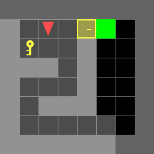

# Dynamic programming for Grid Search

## Overview
implements dynammic programming for the Door-Key problems.
<p align="center">
</br>
</p>

There are 7 test scenes 

| doorkey-5x5-normal |
|:----------------:|
|  |

| doorkey-6x6-normal   | doorkey-6x6-direct | doorkey-6x6-shortcut |
|:----------------:|:------------------:|:----------------:|
|  |  ||

| doorkey-8x8-normal   | doorkey-8x8-direct | doorkey-8x8-shortcut |
|:----------------:|:------------------:|:----------------:|
|  |  ||

## Installation

- Install [gym-minigrid](https://github.com/maximecb/gym-minigrid)
- Install dependencies
```bash
pip install -r requirements.txt
```

## Instruction

### 1. utils.py
some useful tools in utils.py
- **step()**: Move your agent
- **generate_random_env()**: Generate a random environment for debugging
- **load_env()**: Load the test environments
- **save_env()**: Save the environment for reproducing results
- **plot_env()**: For a quick visualization of your current env, including: agent, key, door, and the goal
- **draw_gif_from_seq()**: Draw and save a gif image from a given action sequence.

